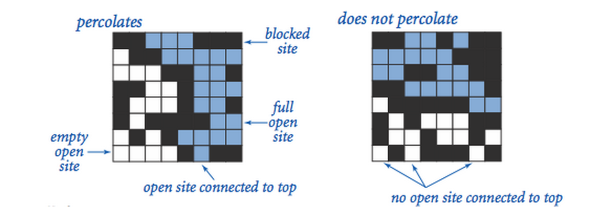
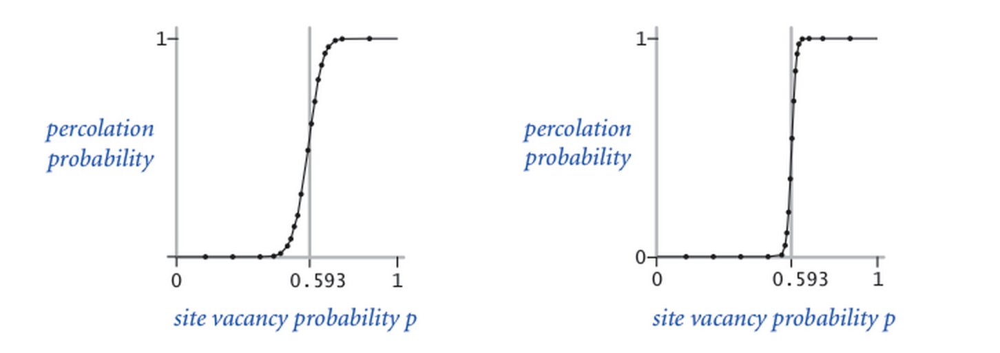

#Percolation - Weighted Quick-Union Algorithm

#####This is an assignment from the Algorithms Part 1 course taught by [Kevin Wayne](https://www.coursera.org/instructor/~204) and [Robert Sedgewick](https://www.coursera.org/instructor/~211). [Click here to view the course.](https://www.coursera.org/course/algs4partI) 

###Requirements:
- Has to be written in Java.
- Has to implement the weighted quick-union algorithm
- Has to be submitted in single files percolation & percolation stats (no OOP).
- Submission may not call any library functions other than those in java.lang, stdlib.jar, and WeightedQuickUnionUF (from given jar).
- Must use the given API, no removing any of it (stated below).
- Must adhere to performance requirements and include corner cases exception handling (stated below in the problem section)

###The Percolation Model:
We model a percolation system using an N-by-N grid of sites. Each site is either open or blocked. A full site is an open site that can be connected to an open site in the top row via a chain of neighboring (left, right, up, down) open sites. We say the system percolates if there is a full site in the bottom row. In other words, a system percolates if we fill all open sites connected to the top row and that process fills some open site on the bottom row.



###The Problem:
In a famous scientific problem, researchers are interested in the following question: if sites are independently set to be open with probability p (and therefore blocked with probability 1 − p), what is the probability that the system percolates? When p equals 0, the system does not percolate; when p equals 1, the system percolates. The plots below show the site vacancy probability p versus the percolation probability for 20-by-20 random grid (left) and 100-by-100 random grid (right).

When N is sufficiently large, there is a threshold value p* such that when p < p* a random N-by-N grid almost never percolates, and when p > p*, a random N-by-N grid almost always percolates. No mathematical solution for determining the percolation threshold p* has yet been derived. Your task is to write a computer program to estimate p*.



#####Corner cases:
By convention, the row and column indices i and j are integers between 1 and N, where (1, 1) is the upper-left site: Throw a java.lang.IndexOutOfBoundsException if any argument to open(), isOpen(), or isFull() is outside its prescribed range. The constructor should throw a java.lang.IllegalArgumentException if N ≤ 0.

#####Performance requirements:
The constructor should take time proportional to N2; all methods should take constant time plus a constant number of calls to the union-find methods union(), find(), connected(), and count()

#####Percolation data type:
To model a percolation system, create a data type Percolation with the following API:
```java
public class Percolation {
   public Percolation(int N)           // create N-by-N grid, with all sites blocked
   public void open(int i, int j)      // open site (row i, column j) if it is not open already
   public boolean isOpen(int i, int j) // is site (row i, column j) open?
   public boolean isFull(int i, int j) // is site (row i, column j) full?
   public boolean percolates()         // does the system percolate?

   public static void main(String[] args) //test client (optional)
}
```
#####Percolation Stats data type:
To perform a series of computational experiments, create a data type PercolationStats with the following API.

```java
public class PercolationStats {
   public PercolationStats(int N, int T)   // perform T independent experiments on an N-by-N grid
   public double mean()                    // sample mean of percolation threshold
   public double stddev()                  // sample standard deviation of percolation threshold
   public double confidenceLo()            // low  endpoint of 95% confidence interval
   public double confidenceHi()            // high endpoint of 95% confidence interval

   public static void main(String[] args)  // test client (described below)
}
```
The constructor should throw a java.lang.IllegalArgumentException if either N ≤ 0 or T ≤ 0.
Also, include a main() method that takes two command-line arguments N and T, performs T independent computational experiments (discussed above) on an N-by-N grid, and prints out the mean, standard deviation, and the 95% confidence interval for the percolation threshold. Use standard random from our standard libraries to generate random numbers; use standard statistics to compute the sample mean and standard deviation.
